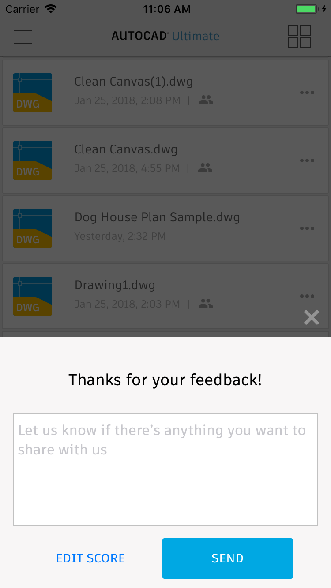
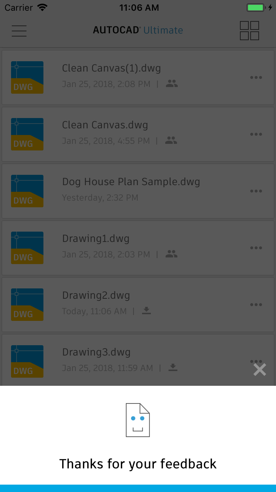

# ADNetPromoterScoreSurvey

[](https://travis-ci.org/Autodesk/ADNetPromoterScoreSurvey-iOS)
[](http://cocoadocs.org/docsets/ADNetPromoterScoreSurvey)
[](https://swift.org)
[](https://developer.apple.com/ios)

ADNetPromoterScoreSurvey is an iOS component that presents [Net Promoter Score (NPS)](https://en.wikipedia.org/wiki/Net_Promoter) survey dialog to the user.

<p align="center" >
      
</p>

## Features
* Popup NPS survey dialog
* Callbacks on user interaction
* Final callback with user score, promoter type and feedback
* Customize the dialog's UI with your own style.

## Support and requirements
* iOS 9 and higher
* Swift 5
* Supports iPhone X

## Installation
#### Cocoapods (Version 1.4.0 or later)
`pod 'ADNetPromoterScoreSurvey'`

## Getting started
Create ADNetPromoterScoreSurvey member
```
var npsSurvery = ADNetPromoterScoreSurvey()
```

#### Show The survey
Just call `showSurvey` function view controller whenever you want to show the survey:
```
self.npsSurvery.showSurvey(onViewController: self)
```

#### Delegate Methods
Implement `NetPromoterScoreSurveyDelegate` to get survey results and user interaction callbacks
```
self.npsSurvery.delegate = self
```

## Implementing NetPromoterScoreSurveyDelegate protocol:
All delegate methods are ``optional``:

```
@objc optional func netPromoterScoreViewDidChange(_ npsSurvey: ADNetPromoterScoreSurvey,
                                                       toView: NetPromoterScoreViewType)
```
Implement this method to receive a callback when survey view changed. 
``toView`` will hold the active view type (scoreQuestionView, feedbackQuestionView, thankYouView)
- - -

```                                                       
@objc optional func netPromoterScoreDidPressSendScore(_ npsSurvey: ADNetPromoterScoreSurvey,
                                                    selectedScore: Int)
```
Implement this method to receive a callback when the user click on "Send" Button after selecting score in the Score Question View.
- - -

```                                                    
@objc optional func netPromoterScoreDidChangeScoreValue(_ npsSurvey: ADNetPromoterScoreSurvey,
                                                      newScoreValue: Int)
```
Implement this method to receive a callback when the user change the score in the Score slider.
- - -

```                                                      
@objc optional func netPromoterScoreDidPressEditScore(_ npsSurvey: ADNetPromoterScoreSurvey)
```
Implement this method to receive a callback when the user back to edit score from the "Feedback View"
- - -

```
@objc optional func netPromoterScoreSurveryCompleted(_ npsSurvey: ADNetPromoterScoreSurvey,
                                                    surveyResult: NPSResult)
```
Implement this method to receive a callback when the survey proccess completed and get the whole survey result.
``surveyResult`` parameter provides summary of the survey result (score, feedback, promoterType).
- - -

```                                                    
@objc optional func netPromoterScoreDidPressClose(_ npsSurvey: ADNetPromoterScoreSurvey,
                                                     fromView: NetPromoterScoreViewType)
                                                    
```
Implement this method to receive a callback when the user closes the survey. ``fromView`` will hold the view type that was active when the user closed the survey.

## Custom Appearance
In order to use you custom texts and fonts you can change the appearnce of the survey.

Changing text:
```
self.npsSurvery.appearance.scoreQuestionViewAppearance.questionText = "My custom question text" 
```
Changing font:
```
self.npsSurvery.appearance.feedbackQuestionViewAppearance.textFieldFont = UIFont(name: "My Custom Font Name", size: 14)
```
Changing colors:
```
self.npsSurvery.appearance.scoreQuestionViewAppearance.highRankTitleColor = UIColor.red
self.npsSurvery.appearance.feedbackQuestionViewAppearance.titleFontColor = UIColor.red
self.npsSurvery.appearance.thankYouViewAppearance.backgroundColor  = UIColor.black
```

## Example Project

1. Clone the repository to your local environment
2. Go to dir `NetPromoterScoreSurveyExample`
3. Execute `pod install`
4. Open Xcode workspace `NetPromoterScoreSurveyExample.xcworkspace`
5. Run

## Change Log
See [Change Log](./CHANGELOG.md) page.

## Contributing
See [Contributing](./Contributing.md) page.

## Contact
[Tomer Shalom](https://github.com/applitom)

